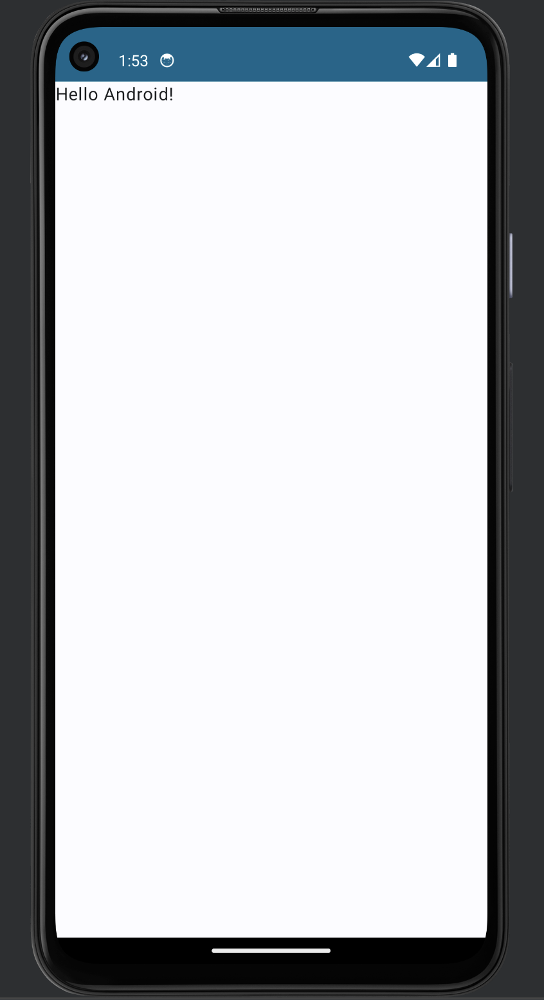
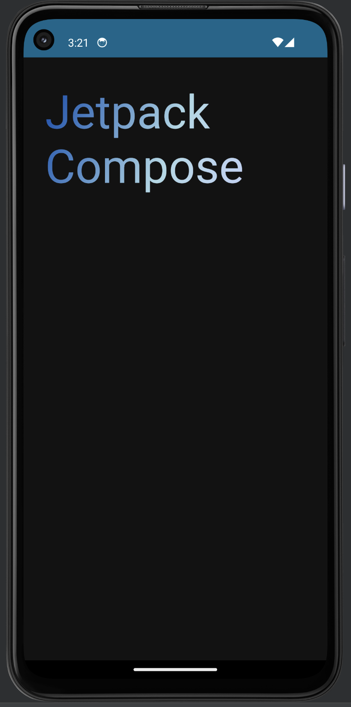
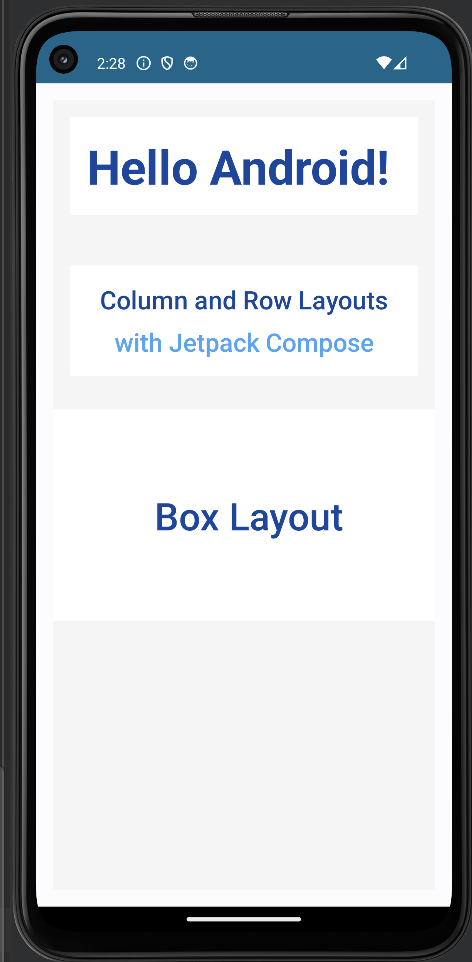

# ComposeTutorial

The Greeting project demonstrates the use of Jetpack Compose for building Android UIs, focusing on text modifiers and activity lifecycle logging.

## Overview

The app showcases various text modifiers available in Jetpack Compose. It includes examples of padding, background color, font size adjustments, and text styles. 

## Modifiers Used

- **Padding**: Adds spacing around UI elements.
- **Background Color**: Sets the background color of text or containers.
- **Font Size**: Adjusts the size of text displayed.
- **Text Style**: Applies different text styles like bold, italic, etc.

## Initial Preview

The app initially displays a single `Text` composable styled using Jetpack Compose without any modifiers applied.

## Final Preview

After applying text modifiers and styling, here is the updated appearance:

### Styling Used for Text Composable

The `Text` composable in the app was styled using various modifiers and styles to achieve the final appearance. This includes adjusting padding, setting background colors, changing font sizes, and applying different text styles such as linear gradient and specific colors.

## Preview of Layouts
Updated appearance of Greeting app with layouts:

