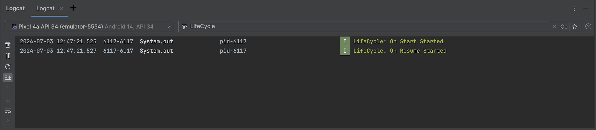

# Android Activity Lifecycle

The Android Activity Lifecycle represents the various states an activity can transition through during its lifetime, from creation to destruction. Understanding these states and lifecycle callback methods is crucial for managing app behavior and resource allocation efficiently.

## Lifecycle States and Lifecycle Callback Methods

### Created (onCreate())
- The activity is being created.
- Initial setup of the activity, such as layout inflation and UI initialization, occurs here.
- **Callback Method:** onCreate()

### Started (onStart())
- The activity is visible but not yet interactive.
- Any preparations that are required when the activity becomes visible can be done here.
- **Callback Method:** onStart()

### Resumed (onResume())
- The activity is in the foreground and interactive.
- This is the state where the activity is actively running and responding to user input.
- **Callback Method:** onResume()

### Paused (onPause())
- The activity loses focus but is still visible.
- This state occurs when another activity comes to the foreground (partially covering the paused activity) or when the device screen turns off.
- **Callback Method:** onPause()

### Stopped (onStop())
- The activity is no longer visible to the user.
- This can happen when the user navigates to another activity or when the activity is being destroyed.
- **Callback Method:** onStop()

### Destroyed (onDestroy())
- The activity is being destroyed.
- This can happen either due to the user finishing the activity or the system reclaiming resources.
- **Callback Method:** onDestroy()

### Restarted (onRestart())
- The activity is being restarted from a stopped state.
- This occurs when the activity is brought back to the foreground after being stopped.
- **Callback Method:** onRestart()

## Preview of Logcat Window during the Calling of onStart() and onResume() Methods

